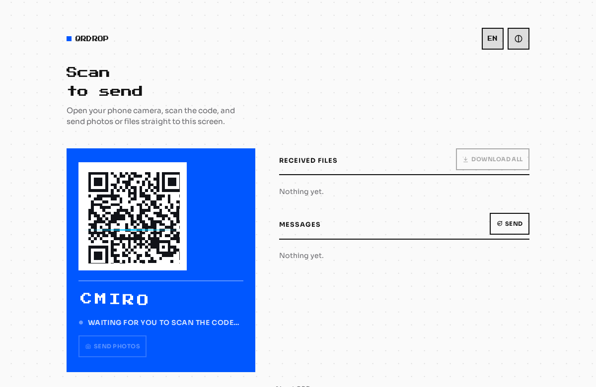

# QRDrop

[](https://github.com/mxnueel/QRDrop/actions/workflows/ci.yml)
[](LICENSE)
[](https://render.com/deploy?repo=https://github.com/mxnueel/QRDrop)



Open it on your PC, scan the QR with your phone's camera, and send photos, files, or text straight through a real peer-to-peer WebRTC connection — no app, no cable, no cloud storage in between. A fork of [PairDrop](https://github.com/schlagmichdoch/PairDrop) with a camera-first pairing flow and a full rebuild of the UI.

## Por qué

PairDrop (which this is built on) already proves the demand: it's a maintained fork of Snapdrop with thousands of GitHub stars, solving the everyday annoyance of "how do I get this file from my phone to my PC without a cable or uploading it somewhere." What I changed is *how you pair*: PairDrop's normal flow is typing a room code by hand. Here, the PC screen shows a QR code and your phone's camera does the pairing — the same motion everyone already does to open a menu or a payment link, no code to type.

## Qué cambié sobre PairDrop

- Custom two-screen QR-first pairing flow (scan → send) replacing manual room-code entry
- Bidirectional minimalist text transfer between PC and phone
- PC→phone photo sending, in addition to the original phone→PC direction
- Room persistence across reloads, so a QR code someone already has open on their phone doesn't go stale the moment the PC tab refreshes
- Debounced reconnect handling for transient WebRTC disconnects
- TURN server config via an environment variable instead of a file committed to the repo
- A full visual redesign: bold flat color blocks, custom typography, real motion — replacing the original PairDrop look

## Cómo lo verifiqué

An automated test can't physically point a camera at a QR code. So the test does exactly what a real phone scan produces: it reads the same URL the QR encodes (`send.html?room_id=<id>`) and opens it in a second, completely separate headless Chromium instance — then lets the actual signaling server and a real WebRTC data channel between two real browsers do the rest. Nothing about the transfer itself is mocked.

The file-transfer test hashes the file on both ends (SHA-256) to prove the bytes that arrive are identical to the bytes that were sent, not just "some file arrived."

## Features

- Scan-to-pair: no typing, no account, no app install
- Send original-quality or auto-compressed photos
- Send arbitrary files, individually or as a batch download
- Send quick text messages in either direction
- Works over your local network or the internet via PairDrop's public rooms
- Self-hostable — deploy your own instance in one click (see below)

## Deploy your own instance

This runs a small persistent Node.js server for WebRTC signaling, so it can't be hosted on a static site like GitHub Pages. It ships with a `Dockerfile` and a `render.yaml`, so the button above deploys a working instance to Render's free tier in a couple of minutes — or run `docker build . -t qrdrop && docker run -p 3000:3000 qrdrop` anywhere else that runs containers.

## Run locally

```bash
npm install
npm start
# open http://localhost:3000
```

## Testing

```bash
npm install
npx playwright install chromium
npm test
```

4 end-to-end tests, driving two real headless Chromium browsers against the real server:
- **Real file transfer** — phone sends a file to PC over an actual WebRTC data channel; the received file is verified byte-identical to the original via SHA-256
- **Real text transfer** — phone sends a text message to PC, content verified on arrival
- **Room persistence** — reloading the PC tab keeps the same room id, so an already-scanned QR code keeps working
- **Invalid link handling** — opening the send screen with no `room_id` shows the invalid-link screen instead of a broken UI

CI runs the full suite on every push.

## License

This is a fork of [PairDrop](https://github.com/schlagmichdoch/PairDrop) by Schlagmichdoch, itself based on [Snapdrop](https://github.com/RobinLinus/snapdrop) by Robin Linus. Licensed under GPL-3.0, same as upstream — see [LICENSE](LICENSE).
